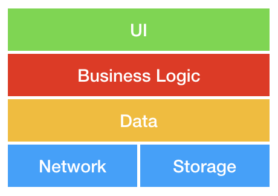
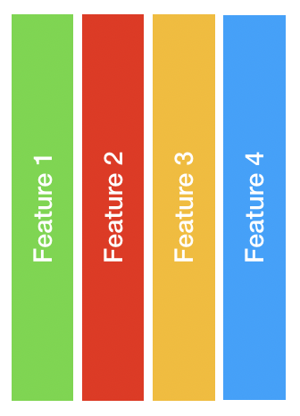
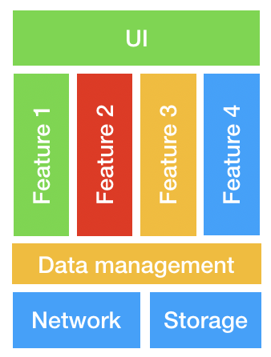
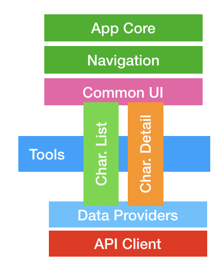
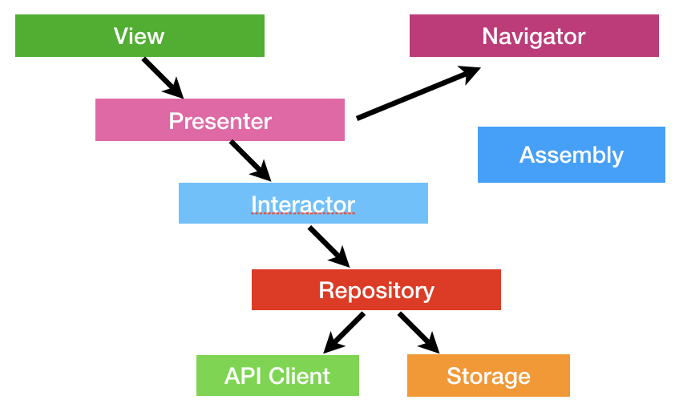

# Excelsior
### Just playing with Marvel Open API in a demo project.

The idea behind this project is to develop an iOS app with an scalable architecture , putting into practice several design patterns.
 
Due to that, some parts are quite over-engineered as the main goal is to design a solid architecture, this code is not production ready.

## 💬 Description 

### Disclaimer

Talking about architectures is quite hard as everybody has a preferred one, normally the one that works better for solving a specific problem.
 
Please, be open minded with this repo. The idea is to develop several patterns that have solved problems in projects I worked on over the last years.

The main objective is not to develop a **perfect** architecture (That's not a real thing) but to try to solve a common problem, make a scalable architecture, divided in several independent frameworks in order to allow the collaboration of a **big** number of developers in a **huge** project with as many conflicts as possible.

### Vertical vs horizontal frameworks

• **Horizontal frameworks** are great for base layers to be used by several teams. Problem is that it's easy to generate conflicts as everybody needs to touch common code all time to develop a new feature.

• **Vertical frameworks** are great to avoid conflict between several teams, as one team only needs to modify (or create) a framework for a functionality. Problem is that part of the code will be repeated (ex: the part that controls network events) or disseminated in several parts.

• **Mixed approach** Why not having the best from both worlds? Well, that's complicated. Creating a mixed approach with horizontal frameworks for common code parts and vertical features has a lot of challenges but it looks as the best approach for big applications.
Main challenge is to define the boundaries of each framework and define how is responsible of maintain the common parts
.

## 🏗Frameworks architecture

Finally, for this demo I decided to implement a mixed approach, with some horizontal frameworks that provides common functionality and horizontal frameworks for each main feature
- **AppCoreKit** that maneges the app lifecycle and initializes all other frameworks.
- **NavigationKit** that allows us to navigate between features.
- **CommonUIKit**  with all common views, fonts, styles and assets.
- **ToolsKit** that contains common code, utils, etc.
- **DataProviders** that implements the repository pattern to hide network or storage complexity to upper layers
- **APIClient** that contains the Marvel API client used in this demo project

### 🏠Features internal architecture

For the internal construction of each feature I opted for the Model-View-Presenter approach, with an interactor that provides the data through a repository.
 
Is an extension from VIPER architecture, but having the *entities* in *repositories* and using a *Navigator* instead of a *Router*.
For the building of all parts of the app, *Assemblies* are used, that allow dependency inversion through layers due to the injection of dependencies. This approach facilitates testing as all dependencies are injected during the construction of the objects.
Also most boundaries between layers are defined by protocols to avoid coupling the code. This abstraction also allows to create test doubles for the unit tests.

For the API client, there are several public frameworks to consider, like Moya, but finally I decided to use a custom implementation as Moya’s approach doesn’t scale with medium to big teams. With Moya you end up with a single [big enum type](https://github.com/Moya/Moya/blob/master/docs/Examples/Basic.md) that contains lots of details. Merge conflicts within that file will certainly arise, and generally, the end file will be hard to process. The "open/close" principle of SOLID is broken.

## 📌 Features 

- [x] List of Marvel characters.
- [x] Detail of a specific character.

## 😬 Todo 

- [ ] Add tests to the other feature.
- [ ] Improve the way the list behaves when new data arrives.
- [ ] Implement a multicast delegate in the repo to inform upper layers for data changes.
- [ ] Implement an storage to avoid unnecessary network calls to ask for characters already loaded.
- [ ] Implement an API client with stub responses in order to improve UI tests.
- [ ] Localization
- [ ] Integrate project with a CI service tool to automate all the things.

## ⚙️ Requirements

- Xcode >= 11.3

## 🔍 References

- **[Clean Architecture](https://blog.cleancoder.com/uncle-bob/2012/08/13/the-clean-architecture.html)** - "The clean cloder blog" [Robert C. Martin (Uncle Bob)](https://twitter.com/unclebobmartin)

- **[Viper](https://www.objc.io/issues/13-architecture/viper/)** - "Architecting iOS Apps with VIPER" By [Jeff Gilbert](jeff.gilbert@mutualmobile.com) and [Conrad Stoll](https://twitter.com/conradstoll)

- **[Repository Pattern](https://martinfowler.com/eaaCatalog/repository.html)** - "Catalog of Patterns of Enterprise Application Architecture" by Edward Hieatt and Rob Mee

- **[API Client](https://medium.com/makingtuenti/writing-a-scalable-api-client-in-swift-4-b3c6f7f3f3fb)** - "Writing a Scalable API Client in Swift 5"  [Victor Pimentel](https://medium.com/@VictorPimentel)

- **[Navigation](https://jobandtalent.engineering/the-navigator-420b24fc57da)** - "Another twist to iOS navigations" [Ruben Mendez](https://jobandtalent.engineering/@ruben.mendez)

- **[Dependency Injection](https://www.vadimbulavin.com/dependency-injection-in-swift/)** - "Advanced Dependency Injection on iOS with Swift 5" by [Vadim Bulavin](https://www.vadimbulavin.com)

## 🍔 Author

- Rafael Bartolomé – [@rafaelbartolome](https://twitter.com/rafaelbartolome) – rafa@rafaelbartolome.es

## 📄 License

Excelsior is available under the MIT license. See ``LICENSE`` file for more information.